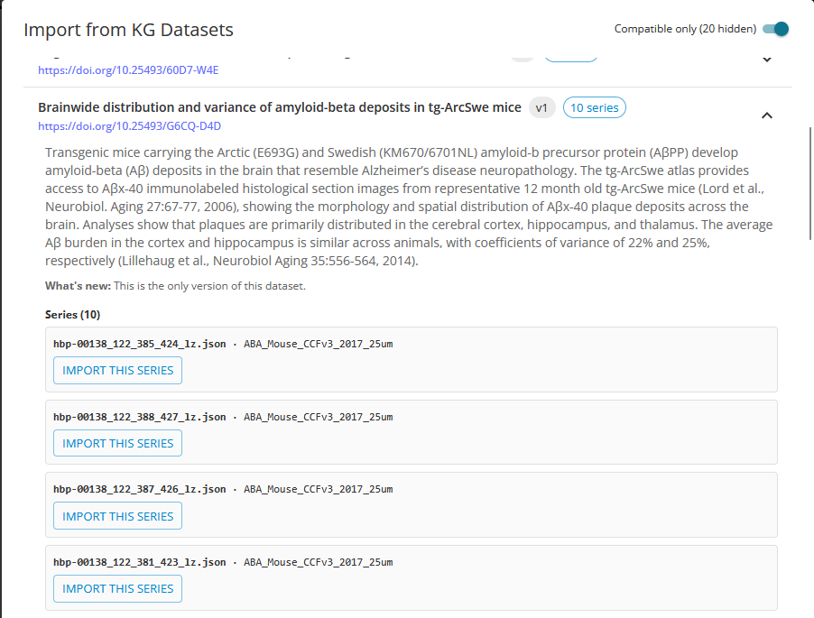
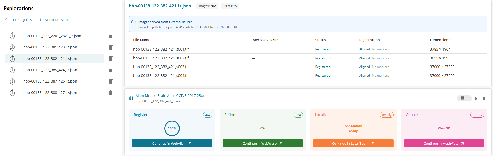

**Upload EBRAINS datasets**
==============================================================

In order to work with a published EBRAINS dataset, press +ADD/EDIT SERIES, then IMPORT FROM KG DATASETS.
A new window will open with the list of available EBRAINS datasets.
Select one dataset, select the animal series and "SUBMIT". The series will be added to your project. 

