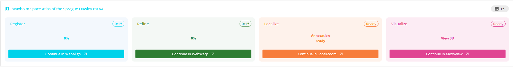
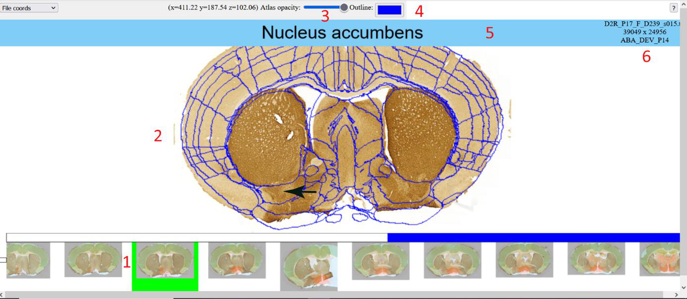
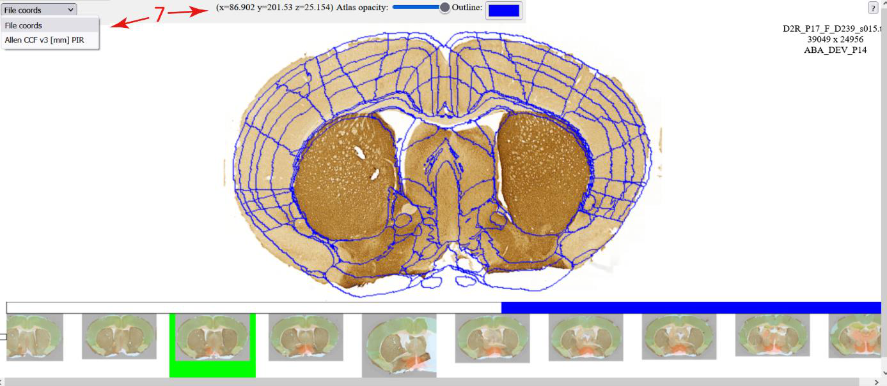
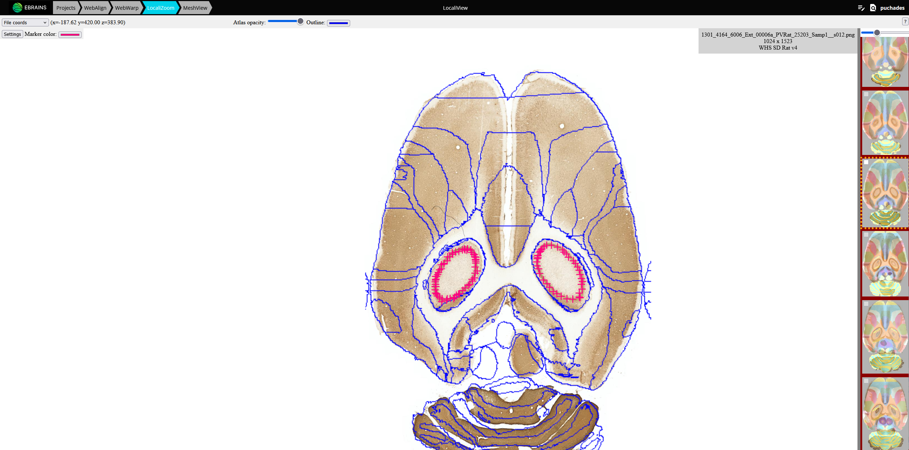

**LocaliZoom viewer and annotation tool**
========================================

LocaliZoom is the next step in the workflow where you can annotate points of interest in your images. As for the other apps, you can use the tab on top of the page or access LocaliZoom from the project page.

 

**Basic operations**
---------------------------

In LocaliZoom viewer, serial section images (1) are represented in a
filmstrip at the bottom of the webpage user interface, with the selected
section image shown with an atlas overlay (2) in the main view.

In the upper panel, users can adjust the transparency of the atlas
overlay (3) allowing them to see the experimental image and the atlas
regions simultaneously. The outline appears when minimum transparency is
selected. It is possible to change the colour of the outline (4) and see
the name of the image file (6).

In the middle panel, the pointer of the mouse will show the atlas region
name (5). The main image can be zoomed and panned.

**Controls**:
------------------

• Pan and zoom with mouse drag and mouse scroll wheel            
• Step backwards and forwards in series with left and right arrow keys                                                      
• Quick set segmentation transparency to minimum and back using down and up arrow keys                                          
• Drag an annotation marker to refine its position                

**Coordinates of points**
---------------------------

The user can visualise the coordinates of the mouse pointer (7) and
switch between different coordinate spaces when available.

**Annotations**
---------------------
Add markers e.g. representing an electrode track or labelling of cells.
You can zoom-in your images uisng the mouse wheel and observe brain regions, names, and
boundaries.

Dataset DOI: https://doi.org/10.25493/G6CQ-D4D

**Controls**:
-----------------

• Press Space to annotate points of interest. The color of the points can be changed by clicking on the "Settings button" and on the color. 
• Press Delete to remove an annotation marker under the mouse cursor

The points are saved automatically.

More details can be found here: https://localizoom.readthedocs.io/en/latest/index.html

**Viewing point coordinates in MeshView**

The saved points can be visualised in the 3D viewer, MeshView which is also available in the LocaliView workbench.

Read more about MeshView here: https://meshview-for-brain-atlases.readthedocs.io/en/latest/ 
